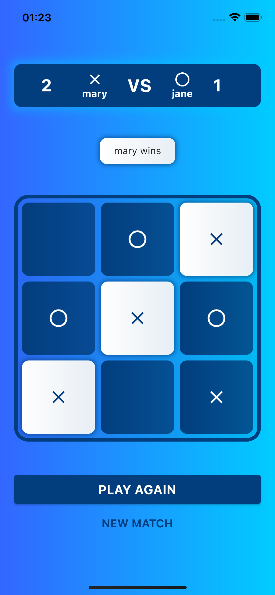

# TTT - TIC TAC TOE

This is a Tic Tac Toe game implemented with flutter.

## Getting Started

- This project was done on **Flutter 2.10.0** version.
- It is using [mobx](https://pub.dev/packages/mobx) to handle the state management.

### Architecture

I used a feature based arch, where I tried to split the features according to it corresponding screen.

The game logic is on the **domain** layer (more espcifically, on
the [Game](https://github.com/henriquezanfa/tictactoe/blob/master/lib/domain/model/game_model.dart) file). This file has
some [unit tests](https://github.com/henriquezanfa/tictactoe/blob/master/test/domain/model/game_test.dart) covering the
basic cases of the game.
